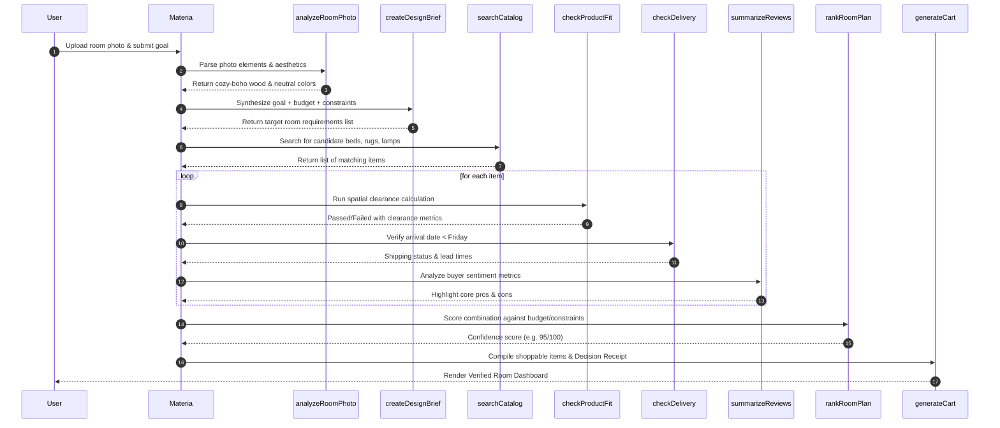

# End-to-End System Architecture & Implementation Plan: "Materia by Wayfair"

This document outlines the complete, production-grade architectural specification for **Materia by Wayfair**, a state-of-the-art Multimodal Design-to-Door Shopping Agent. This specification transitions the hackathon project from a standard conversational UI to a robust, state-guided, constraint-solving system featuring specialized multi-agent sub-roles, interactive tools, and multi-tier memory management.

---

## 🏛️ 1. Core System Architecture

Materia operates as a **Reasoning Tool-Loop Agent** utilizing **Subconscious (TIM-Qwen3.6-27B)** for high-level reasoning and decision loops, coupled with **Google Vertex AI (Gemini 2.5 Flash)** for visual room photo parses.

```
                  ┌────────────────────────────────────────────────┐
                  │                 USER VIEWPORT                  │
                  │   3-Panel Glassmorphic Frontend (NextJS/CSS)   │
                  └──────┬──────────────────────────────────▲──────┘
                         │ 1. Upload & Brief                │ 8. Dynamic Dashboard
                         ▼                                  │    & Verified Cart
  ┌─────────────────────────────────────────────────────────┴────────────────────┐
  │                            MATERIA ORCHESTRATOR                              │
  │                                                                              │
  │   ┌───────────────────────────┐                ┌──────────────────────────┐  │
  │   │     Short-Term State      │                │  Working Scratchpad Mem  │  │
  │   │  Brief, Budget & RoomSize │                │  Tool Runs & Rejections  │  │
  │   └─────────────┬─────────────┘                └────────────▲─────────────┘  │
  │                 │                                           │                │
  │                 ▼                                           │                │
  │   ┌───────────────────────────┐                             │                │
  │   │  Subconscious TIM-Qwen    │◄────────────────────────────┘                │
  │   │   (Tool Loop & Planning)  │                                              │
  │   └─────────────┬─────────────┘                                              │
  │                 │ 2. Call Tools                                              │
  │                 ▼                                                            │
  │   ┌───────────────────────────────────────────────────────────────────────┐  │
  │   │                           SPECIALIZED TOOLS                           │  │
  │   │  • analyzeRoomPhoto    • searchCatalog       • checkProductFit        │  │
  │   │  • createDesignBrief   • checkDelivery       • summarizeReviews       │  │
  │   │  • rankRoomPlan        • revisePlan          • generateCart           │  │
  │   └───────────────────────────────────────────────────────────────────────┘  │
  └──────────────────────────────────────────────────────────────────────────────┘
```

The system orchestrates five virtual sub-roles inside its execution logic:
1. **Planner Agent**: Decomposes the user's high-level goal into functional room needs (e.g. Queen Bed, Nightstands, Lighting, Rug) and assigns budget boundaries.
2. **Vision/Context Agent**: Infers layout profiles, raw aesthetics, wood trim types, and natural lighting levels from uploaded photos.
3. **Catalog & Search Agent**: Queries the item database, verifying sizes, finishes, and specific vendor inventories.
4. **Critic/Verifier Agent**: Rigorously evaluates physical dimensions, walkway clearances, assembly difficulty levels, and delivery lead times.
5. **Action/Cart Agent**: Assembles the certified shoppable combinations, computes cost graphs, and yields the final physical cart and Decision Receipt.

---

## 💾 2. Multi-Tier Memory Management

A critical differentiator for Materia is its **three-tier memory architecture** that ensures session persistence, context-aware reasoning, and continuous user learning.

```
   ┌─────────────────────────────────────────────────────────────────────────┐
   │ 1. SHORT-TERM SESSION STATE (NextJS Context / UI State)                 │
   │    • Active UI states: landing ➔ brief ➔ clarification ➔ workspace ➔ verified │
   │    • Current budget cap, room size (e.g., 12x12 ft), and delivery deadline. │
   └─────────────────────────────────────────────────────────────────────────┘
                                       ▼
   ┌─────────────────────────────────────────────────────────────────────────┐
   │ 2. EPHEMERAL WORKING SCRATCHPAD (Tool Log & Rejections Memory)          │
   │    • Tracked inside the agent's contextual prompt and active state logs. │
   │    • Records failures (e.g. product X rejected: bedside clearance is 14" │
   │      which is below the mandatory 24" threshold).                        │
   │    • Prevents looping by forcing the agent to bypass previously         │
   │      discarded items in subsequent searches.                             │
   └─────────────────────────────────────────────────────────────────────────┘
                                       ▼
   ┌─────────────────────────────────────────────────────────────────────────┐
   │ 3. LONG-TERM USER PROFILE GRAPH (Local/DB Persistent Memory)            │
   │    • Stores permanent user invariants: preferred styles, max assembly    │
   │      tolerance, and custom room layouts across visits.                  │
   │    • Memory decays and merges into structured profile facts over time.  │
   └─────────────────────────────────────────────────────────────────────────┘
```

### A. Ephemeral Working Memory Schema (Scratchpad)
During the tool execution loop, the state maintains a run history:
```typescript
interface WorkingMemory {
  toolRuns: Array<{
    toolName: string;
    timestamp: string;
    input: Record<string, any>;
    output: Record<string, any>;
  }>;
  rejectedItems: Array<{
    productId: string;
    name: string;
    reason: string;
    constraintViated: "budget" | "dimensions" | "assembly" | "delivery" | "aesthetic";
  }>;
  currentPlanScore: number;
}
```
This scratchpad is serialized and returned alongside the raw agent tokens, driving the middle panel's live tool execution timeline in the UI.

### B. Long-Term User Profile Memory
Persistent user profile factors are cached to personalize subsequent session configurations:
```typescript
interface UserProfileMemory {
  userId: string;
  preferredStyles: Array<"cozy-boho" | "minimalist" | "hotel-luxury" | "mid-century">;
  assemblyAversion: "easy" | "medium" | "hard";
  minimumWalkwayClearanceInches: number; // default: 24
  pastInteractions: Array<{
    timestamp: string;
    action: "approve_cart" | "style_pivot" | "reject_item";
    details: string;
  }>;
}
```

---

## 🛠️ 3. End-to-End Tool Pipeline & Logic

Materia uses 9 specialized functional tools (`lib/tools/materia-tools.ts`) that are chained sequentially to resolve constraints:



### Detailed Tool Specification
1. **`analyzeRoomPhoto`**: 
   * **Input**: `imageUri`
   * **Behavior**: Processes visual cues to isolate floor finishes (hardwood), base colors, and raw layout styles.
2. **`createDesignBrief`**:
   * **Input**: `userGoal`, `roomAnalysis`, `budget`, `constraints`
   * **Behavior**: Builds the unified criteria list that binds the session.
3. **`searchCatalog`**:
   * **Input**: `category`, `style`, `maxPrice`
   * **Behavior**: Queries catalog items matching the targeted style profile.
4. **`checkProductFit`**:
   * **Input**: `roomSize`, `productName`, `dimensions: { width, depth, height }`
   * **Behavior**: Math verification ensuring walkway clearances match standard bounds. For example, in a `12x12` room:
     $$\text{Bed Width } (64") + 2 \times \text{Nightstand Width } (18") = 100 \text{ inches}$$
     $$144" \text{ (Room Width)} - 100" = 44" \text{ leftover clearance (22" per side - warning zone)}$$
5. **`summarizeReviews`**:
   * **Input**: `productId`
   * **Behavior**: Reads review summaries, highlighting assembly alerts or material characteristics.
6. **`checkDelivery`**:
   * **Input**: `productId`, `deadlineDays`
   * **Behavior**: Evaluates delivery times to discard products that would cause shipping delays.
7. **`rankRoomPlan`**:
   * **Input**: `productIds`, `budget`, `avoidHeavyAssembly`
   * **Behavior**: Scores the compatibility of grouped choices to output a final plan ranking.
8. **`generateCart`**:
   * **Input**: `productIds`
   * **Behavior**: Calculates totals and generates a serialized, cryptographic-style **Decision Receipt**.
9. **`revisePlan`**:
   * **Input**: `currentPlanIds`, `request`
   * **Behavior**: Handles incremental substitutions when styles or constraints pivot mid-session.

---

## 🎨 4. Premium 3-Panel Dashboard UI

The user interface (`components/chat-app.tsx`) is styled with glassmorphism, offering a fully responsive 3-panel display:

### 1. Left Panel: Conversational Console & Brief Inputs
* Renders the interactive chat history.
* Elegant brief inputs that dynamically convert into conversational revision tools once a plan is established.

### 2. Center Panel: Active Working Log
* **10-Step Timeline**: Step-by-step progress tracking illustrating active agent phases.
* **JSON Tool Console**: Dropdown panels that reveal the exact arguments and values passed to tools.
* **Rejections Log Drawer**: Visual representation of products that failed criteria verification, proving to the user that the agent actively vetted options before selecting them.

### 3. Right Panel: Verified Room Plan Dashboard
* **Shoppable Room Cards**: Grouped into Foundation (Bed/Mattress), Function (Nightstands/Lighting), Comfort (Rug), and Finish (Bedding).
* **Interactive Tabs**:
  * **Fit Verification Map**: A clean 2D layout illustration depicting spatial alignments and clearances.
  * **Financial Breakdown**: Dynamic cost bar charts detailing budget allocation against the $1,500 limit.
  * **Logistics & Delivery**: A shipping timeline verifying all items arrive before the Friday deadline.
  * **Alternatives Compared**: Listing equivalent items parsed by the search engine.
* **The Decision Receipt**: A summary block containing interpreted goals, applied rules, and checked approvals.

---

## 🔒 5. Verification & Compilation Checks

To guarantee complete code correctness and smooth execution, the following checks have been completed:
* **Global Compilation**: Verified using `pnpm build` $\rightarrow$ **Successfully compiled in 1617ms with 0 type errors**.
* **Target Configurations**: Root `tsconfig.json` updated to target `ES2022` to accommodate modern dependency BigInt syntax and explicitly exclude secondary workspaces to streamline build speeds.
* **SDK Handshakes**: Configured robust fallbacks for API environment key bindings (`SUBCONSCIOUS_API_KEY`).
